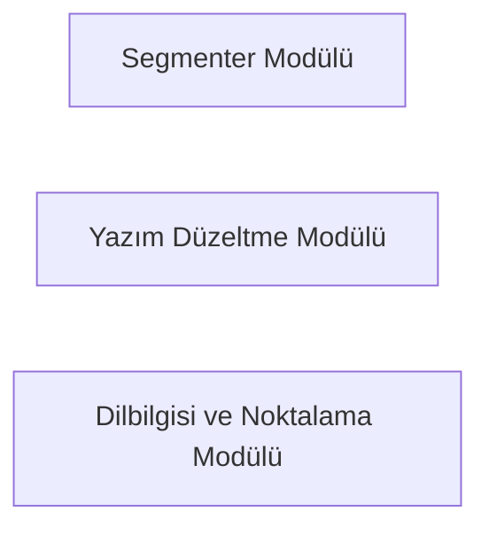

# Çevrimdışı Türkçe Otomatik Düzeltici — Ontoloji

Revizyon: 0. Canlı görünüm için `ontology` komutunu çalıştır.

## Türler ve özellikler

### Yazılım Modülü (`modul`)

- path: string; zorunlu; seçenekler: None
- status: string; zorunlu; seçenekler: ['taslak', 'hazir', 'test_edildi']

## İlişki kuralları

## Somut nesneler

- **Segmenter Modülü** (`modul-segmenter`, modul): {"path": "src/segmenter.py", "status": "taslak"}; durum: pending; üretici: T-MOTOR
- **Yazım Düzeltme Modülü** (`modul-speller`, modul): {"path": "src/speller.py", "status": "taslak"}; durum: pending; üretici: T-MOTOR
- **Dilbilgisi ve Noktalama Modülü** (`modul-grammar`, modul): {"path": "src/grammar.py", "status": "taslak"}; durum: pending; üretici: T-MOTOR

## Nesne haritası

Oklar kayıtlı ilişki yönüdür; değişiklik etkisinin yönü üstte ayrıca tanımlıdır.

## Görevlerin veri bağları

- **T-MOTOR — Segmenter, Speller ve Dilbilgisi motorunu oluştur**: girdiler [], çıktılar [modul-segmenter, modul-speller, modul-grammar], durum todo.
- **T-TEST — 'sendemigeliyorusn' ve varyant testlerini yaz ve doğrula**: girdiler [modul-segmenter, modul-speller, modul-grammar], çıktılar [], durum blocked.

Etki yeniden inceleme ihtiyacıdır; nesnenin yanlış olduğu hükmü değildir.
